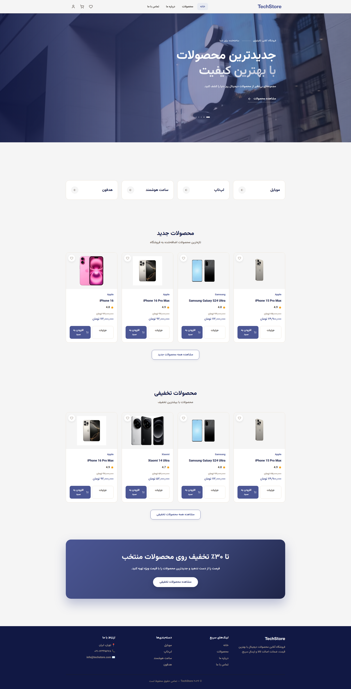

# TechStore 🛒

### Modern E-commerce Web Application

TechStore is a modern, responsive e-commerce web application built with **React and JavaScript**, designed to simulate a realistic online shopping experience.

The project goes beyond a static UI and focuses on **component architecture, global state management, business logic separation, persistent client-side data, responsive design, accessibility, and reusable design patterns**.

---

## 🔗 Live Demo

**[View Live Demo](https://techstorereactshop.netlify.app/)**

---

## 📸 Preview



---

## ✨ Features

### 🛍️ Shopping Experience

- Browse products by category
- Search products by name, brand, and description
- Filter by category, new products, and discounted products
- Sort by price, rating, and newest
- Product detail pages
- Related products
- Product color selection
- Product reviews and ratings
- Favorites / wishlist

### 🛒 Cart & Checkout

- Add, remove, and update cart items
- Persistent shopping cart
- Guest cart support
- Automatic guest-cart merge after login
- Stock validation
- Coupon / discount support
- Checkout form validation
- Address information
- Payment method selection
- Order summary
- Order creation
- Order success flow

### 👤 Authentication & Account

- User registration
- Login / logout
- Forgot-password flow
- Protected routes
- User profile
- Profile information management
- Password management
- Order history
- Order cancellation
- User-specific cart persistence

### ⭐ Favorites & Reviews

- User-specific favorites
- Persistent favorites
- Product reviews
- Rating system
- Review management

### 📦 Order Management

Orders follow controlled status transitions:

```text
Processing
    ↓
Shipped
    ↓
Delivered
```

or:

```text
Processing
    ↓
Cancelled
```

Completed and cancelled orders cannot be moved to another status.

Order cancellation also restores the affected inventory.

### 🧑‍💼 Admin Dashboard

The project includes a protected admin area with:

- Dashboard overview
- Product management
- Add / edit / delete products
- Category management
- User management
- Order management
- Order status management
- Product stock management
- Analytics

Admin access is protected through a dedicated route guard.

---

## 🧠 Technical Highlights

This project was built to demonstrate practical frontend engineering rather than only visual implementation.

### Component Architecture

The application follows a modular React architecture with reusable components organized by responsibility and domain.

### Global State Management

The **React Context API** is used to separate global application state into focused domains:

- Authentication
- Products
- Categories
- Cart
- Orders
- Favorites
- Reviews

This keeps domain-specific state and logic isolated and easier to maintain.

### Business Logic Separation

Business logic is extracted from UI components whenever possible.

For example, the `useCheckout` custom hook handles:

- Checkout validation
- Coupon handling
- Stock validation
- Order creation
- Checkout submission

This keeps pages focused on rendering and user interaction.

### Persistent Client-side Data

Because this is a frontend-only portfolio project, application data is persisted through `localStorage`.

Persisted data includes:

- Users
- Current user
- Products
- Cart
- Favorites
- Orders
- Reviews
- Categories

A reusable storage utility is used instead of accessing `localStorage` directly throughout the application.

### Efficient Cart Data Model

Cart items intentionally store only the minimum required information:

```js
{
  productId,
  selectedColor,
  quantity
}
```

Product details such as price, name, image, and stock are resolved from the current product state instead of storing a complete product snapshot.

This keeps cart state smaller and avoids unnecessary duplication.

### Protected Navigation

The application separates:

- Public routes
- Authenticated user routes
- Admin-only routes

The admin area is protected through a dedicated `RequireAdmin` route guard.

### Lazy Loading

Heavier sections such as:

- Admin Dashboard
- Product Details
- Checkout
- Profile

use lazy loading to reduce the initial loading cost.

### Error Handling

The application includes:

- Global Error Boundary
- Loading states
- Empty states
- Not Found page
- Form validation
- Stock validation
- Protected routes
- Error states

---

## 🎨 Design System

TechStore uses a centralized design system instead of relying entirely on component-level styling.

### Design Tokens

Reusable tokens cover:

- Colors
- Semantic colors
- Typography
- Font weights
- Spacing
- Border radius
- Shadows
- Transitions

Example token categories:

```text
--color-primary
--color-success
--color-error
--color-text
--color-text-muted
--color-border

--space-1
--space-2
--space-3

--radius-sm
--radius-md
--radius-lg
```

Reusable component styles are organized into dedicated style modules for elements such as:

- Buttons
- Forms
- Cards
- Alerts
- Badges
- Layout
- Quantity controls

---

## ♿ Accessibility

Accessibility was considered throughout the interface.

Implemented improvements include:

- Semantic HTML
- Skip-to-content navigation
- Accessible form labels
- `aria-label` for icon-only controls
- Keyboard-friendly interactions
- Proper button types
- Visible focus states
- Meaningful image `alt` attributes
- Form error states
- Responsive navigation

---

## 📱 Responsive Design

TechStore is designed to work across:

- Desktop
- Laptop
- Tablet
- Mobile

Responsive behavior includes:

- Mobile navigation
- Responsive product grids
- Collapsible product filters
- Mobile-friendly checkout
- Responsive admin dashboard
- Flexible cards and forms
- Adaptive typography and spacing

---

## 🏗️ Architecture

```text
src/
├── assets/
│
├── components/
│   ├── admin/
│   ├── checkout/
│   ├── layout/
│   ├── product/
│   └── profile/
│
├── context/
│   ├── AuthContext
│   ├── ProductsContext
│   ├── CategoriesContext
│   ├── CartContext
│   ├── OrdersContext
│   ├── FavoritesContext
│   └── ReviewsContext
│
├── data/
│   └── products
│
├── hooks/
│   ├── useCheckout
│   └── usePageTitle
│
├── models/
│   └── types
│
├── pages/
│
├── services/
│   └── couponService
│
├── styles/
│
├── utils/
│   ├── constants
│   ├── formatPrice
│   ├── orderStatus
│   └── storage
│
├── App
├── main
└── routes
```

---

## 🗺️ Application Flow

### Customer Experience

```text
Home
  ↓
Products
  ↓
Product Details
  ↓
Add to Cart
  ↓
Checkout
  ↓
Order Success
  ↓
Profile / Order History
```

### Admin Experience

```text
Admin Dashboard
       ↓
 ┌─────┼────────┬───────────┐
 ↓     ↓        ↓           ↓
Users Products Orders    Analytics
               ↓
        Status Management
```

---

## 🧭 Routing

Main routes include:

```text
/
├── /products
├── /products/:id
├── /cart
├── /checkout
├── /order-success
├── /favorites
├── /about
├── /contact
├── /login
├── /register
├── /forgot-password
├── /profile
└── /admin
```

Protected routes include:

```text
/checkout
/order-success
/profile
```

Admin-only route:

```text
/admin
```

---

## 🛠️ Tech Stack

| Technology | Purpose |
|---|---|
| React | UI development |
| JavaScript (ES6+) | Application logic |
| Vite | Development & build tooling |
| React Router | Client-side routing |
| Context API | Global state management |
| React Hooks | Reusable state & logic |
| CSS | Styling & design system |
| Lucide React | Icons |
| LocalStorage | Client-side persistence |
| JSDoc | Code documentation |

---

## 🚀 Getting Started

### 1. Clone the repository

```bash
git clone https://github.com/mina-gharzi/techstore-react.git
```

### 2. Navigate into the project

```bash
cd techstore-react
```

### 3. Install dependencies

```bash
npm install
```

### 4. Start the development server

```bash
npm run dev
```

Then open the local development URL provided by Vite.

---

## 👨‍💼 Demo Admin Account

For exploring the admin dashboard locally:

```text
Email: admin@techstore.com
Password: admin123
```

> This is a frontend-only demo account. Production applications should use secure server-side authentication and never store passwords in `localStorage`.

---

## ⚠️ Demo Architecture & Limitations

TechStore is intentionally implemented as a **frontend-only portfolio project**.

The application uses:

- Mock data
- Browser `localStorage`
- Simulated authentication
- Simulated checkout/payment flow
- Client-side inventory management

It is **not intended to represent a production authentication or payment architecture**.

A production version could replace these client-side implementations with a real backend, database, secure authentication system, payment provider, and server-side business logic.

---

## 🎯 Project Goals

The main goals of TechStore were to:

- Build a realistic e-commerce workflow
- Practice React component architecture
- Manage complex global state with Context API
- Separate UI from business logic
- Build reusable components
- Create a centralized design system
- Implement protected routes
- Handle persistent client-side data
- Build responsive interfaces
- Apply accessibility principles
- Practice admin dashboard architecture
- Write maintainable and scalable frontend code

---

## 🔮 Potential Production Improvements

If extended into a production application, the architecture could evolve to include:

- Real backend API
- Database integration
- Secure authentication
- Session / token-based authentication
- Password hashing
- Real payment gateway
- Server-side inventory management
- Server-side order processing
- Image upload and storage
- Product pagination
- Advanced analytics
- Automated testing
- CI/CD pipeline

---

## 👩‍💻 Author

**Mina Gharzi**

Frontend Developer — React / JavaScript

TechStore was created as part of my frontend development portfolio, with a focus on building realistic, maintainable, accessible, and user-friendly web applications.

---

### 🔗 Links

- **Live Demo:** https://techstorereactshop.netlify.app/
- **GitHub:** https://github.com/mina-gharzi/techstore-react